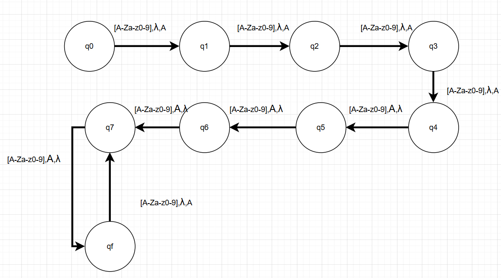
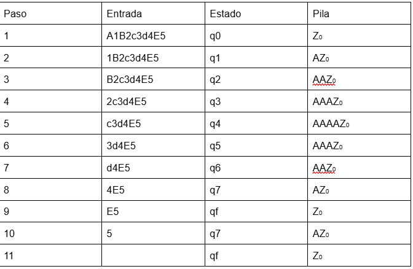

#Maquina de Turing
Autor:Noah Esteban Narváez Jung
Fase 1
Este proyecto requiere validar cadenas formadas únicamente por símbolos alfanuméricos, donde la Máquina de Turing debe detectar el final de la palabra mediante un símbolo de blanco _.
El regex garantiza exactamente ese comportamiento y funciona de la siguiente manera:

La máquina:
1. Inserta relleno aleatorio antes y después de la entrada.
2. Procesa los símbolos uno por uno.
3. Se mueve solo hacia la derecha.
4. Aumenta su número de estado al leer un símbolo válido.
5. Rechaza si encuentra un carácter no alfanumérico.

Acepta cuando alcanza el blanco (_) tras leer todos los símbolos de la cadena.
-^[a-zA-Z0-9]+_$ es el regiex que se eligió y acepta tanto números como dígitos
-_ representa el espacio blanco
-^ y $ → Aseguran que toda la cadena cumpla el patrón y no contenga otros símbolos
Este regex coincide con la validación implementada en el cógigo, donde cada símbolo se verifica usando:
/^[a-zA-Z0-9]$/.test(symbol) que corresponde al sigiuente lenguaje:

L={a∣a∈[a-zA-Z0-9]}, es un lenduaje regular ya que es finito y puede ser reconocido por un AFD

La quinta tupla es la siguiente

Q = {q0, q1, q2, q3, q4, q5, q6, q7, qf}
Σ = {A–Z, a–z, 0–9}
Γ = {Z0, A}
q0 = Estado inicial
F = {qf}

δ(q0, a, Z0)  ⟶ (q1, A Z0)  
δ(q1, a, A)   ⟶ (q2, A A)
δ(q2, a, A)   ⟶ (q3, A A)
δ(q3, a, A)   ⟶ (q4, A A)
δ(q4, a, A)   ⟶ (q5, A A)
δ(q5, a, A)   ⟶ (q6, A A)
δ(q6, a, A)   ⟶ (q7, A A)
δ(q7, a, A)   ⟶ (qf, A)
δ(q7, a, Z0)  ⟶ (qf, Z0)  

Tomando como ejemplo la siguiente cadena alfanumérica valida
A1B2c3d4E5, esta es la tabla de transiciones

Link a la maquina de Turing: [https://sicalo330.github.io/Maquina-de-turing]